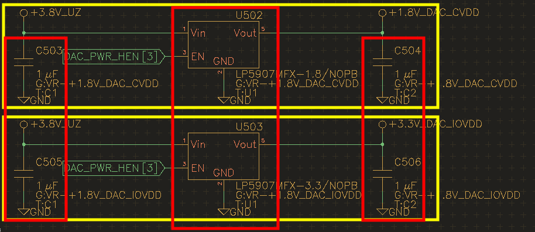

Copying layout and placement
=============================

Motivation
----------

Often times, your design includes similar-but-not-identical sections
such as voltage regulators. Wouldn’t it be nice if you’d only had to do
layout and placement once and then copy it to the other instances?
Horzion EDA lets you do just that in a simple two-step process.

Groups & Tags
-------------

For this feature to work, you’ll first need to tell horizon EDA how the
components fit together. This is accomplished by assigning groups and
tags to components. Each section, i.e. all components associated with
one voltage regulator, get assigned one group. To do so, select all
symbols of one section and use the tool “Set new group” to assign all of
them to a new group. For making groups and tags visible on the
schematic, use the “Toggle group & tag visibility”. A components group
and tag will then show up below the reference designator.

To tell horizon EDA the matching components in each group, these get
assigned identical tags. Since a newly-placed component will already be
assigned a unique tag and groups and tags get preserved on copy/paste
other instances of the same circuit will likely have the appropriate
tags already set. To change the tag on a component, use the “Set tag”
tool.

When you’re done, the schematic should roughly look like this (with the
boxes added for clarification). All components inside a yellow box
belong to the same group, all inside a red box belong to the same tag.

You may use the “Highlight group/tag” action to make sure that you got
the assignments right.

Board
-----

Place and route any group as usual.

Copy placement
~~~~~~~~~~~~~~

For each group, place the package you’d like the other packages to be
referenced to at the desired position and place all other packages
anywhere. Then, select all packages of the group that you’d like to
apply the placement to and start the “Copy placement” tool. Click on the
reference package (any pad or centroid) in the already placed group and
all selected packages will be placed accordingly.

Copy tracks
~~~~~~~~~~~

Select all tracks (other objects will be ignored) you want to copy in
the routed group, start the “Copy tracks” tool and click on any package
(any pad or centroid) in the destination group.

