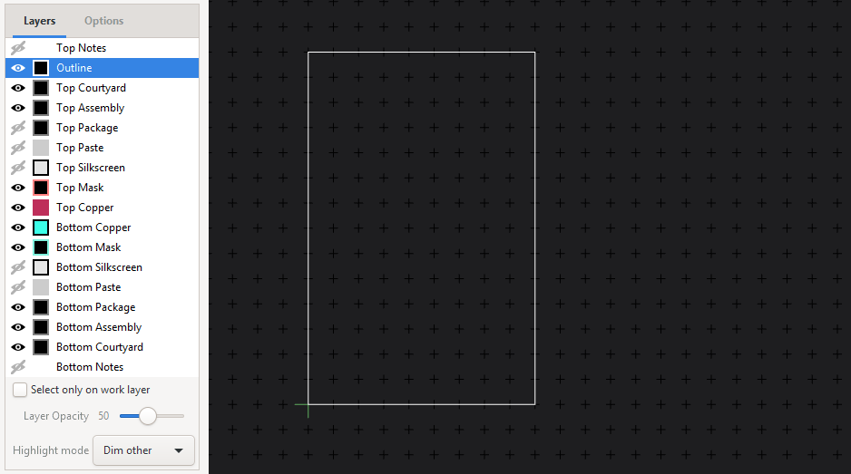
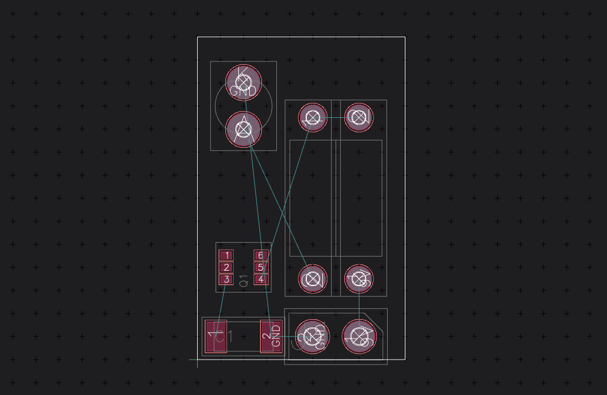
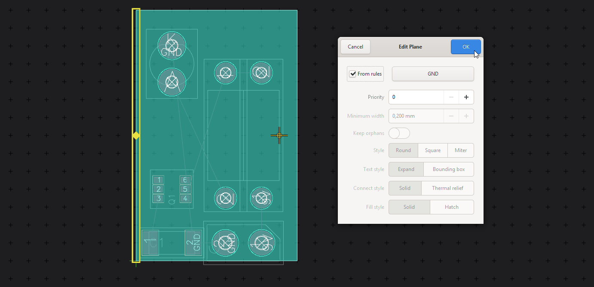
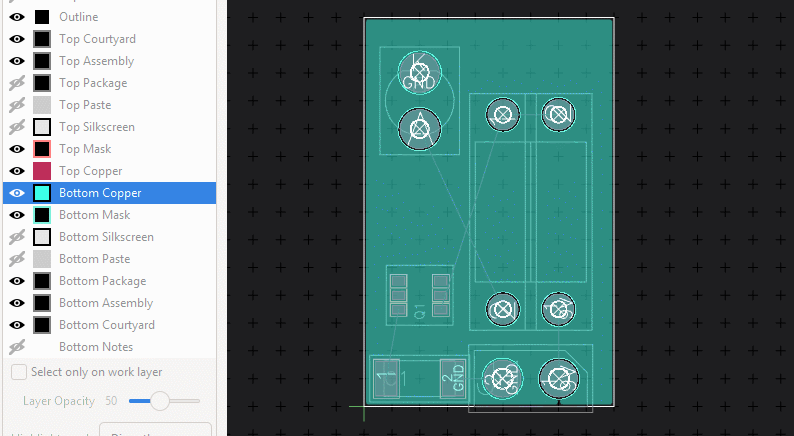
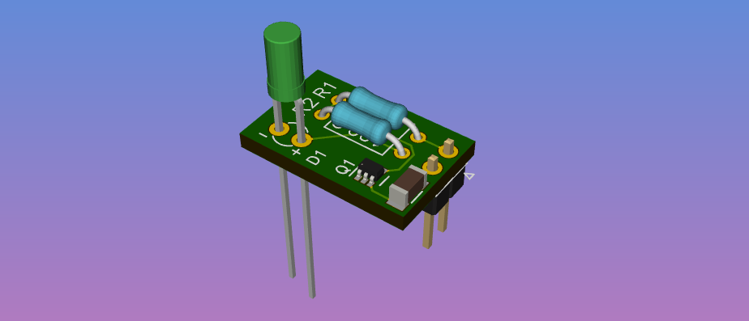

Create a Board
==============

Open the board editor from the Project manager. 

Draw a Board Outline
~~~~~~~~~~~~~~~~~~~~

Draw a outline by first selecting the "Outline" Layer in the Layers Panel and then selecting the "Draw polygon rectangle" Tool by typing :kbd:`d Y` (or use the Spacebar menu):

Place the Packages
~~~~~~~~~~~~~~~~~~

Place packages on the board using by typing :kbd:`p p` (this time it stands for "Place Package"). If you still have the Schematic Editor open you can also select a Symbol and use the "Place on Board" Tool by clicking it's button in the top bar.

If you select Parts in the Schematic Editor they will also be highlighted in the Board Editor. If you change something in the Schematic Editor bring the changes from the schematic to the board, by saving the schematic and clicking 'reload netlist' in the board editor.

If you want to place a part on the bottom of the board, press :kbd:`e` to flip it to the bottom side. If you are working a lot on the bottom you can use the "View bottom" tool to flip the whole board around.

Add Planes
~~~~~~~~~~

If you want to use a Ground Plane now would be a good time to add it:

1. Select the layer you want to have the plane on (Top- or Bottom-Copper)
2. Draw a polygon rectangle by typing :kbd:`d Y`
3. Right-Click one of the Edges of the newly added polygon and select "Add Plane"
4. In the Window that pops up select the GND net (if it is not there you didn't add the power net in the Schematic)

If the solid filled color of the plane annoys you, you can switch the display style to something else by clicking onto the colored square left of the layer:

Route the Nets
~~~~~~~~~~~~~~

To route tracks between the parts you connected in the Schematic, type :kbd:`x` and drag from any pin that starts an airwire: 

.. raw:: html

   <video autoplay loop muted src="_static/draw-track.mp4"></video>  

The track will always be routed on the layer you have selected, you can quickly select the Top Copper Layer by pressing :kbd:`1` and the Bottom Copper Layer by pressing :kbd:`2`. 

If you want to change sides in the middle of a track you can place a via by pressing :kbd:`v` and then the number of the layer you want to continue.

Once you are done, check out the 3D view of your part, and export Gerbers using the menu point "Fabrication Output" in the application menu.

Next: :doc:`Look at a Example Project <example-project>`
