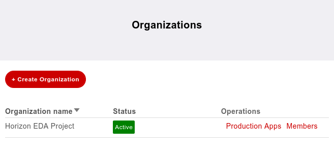
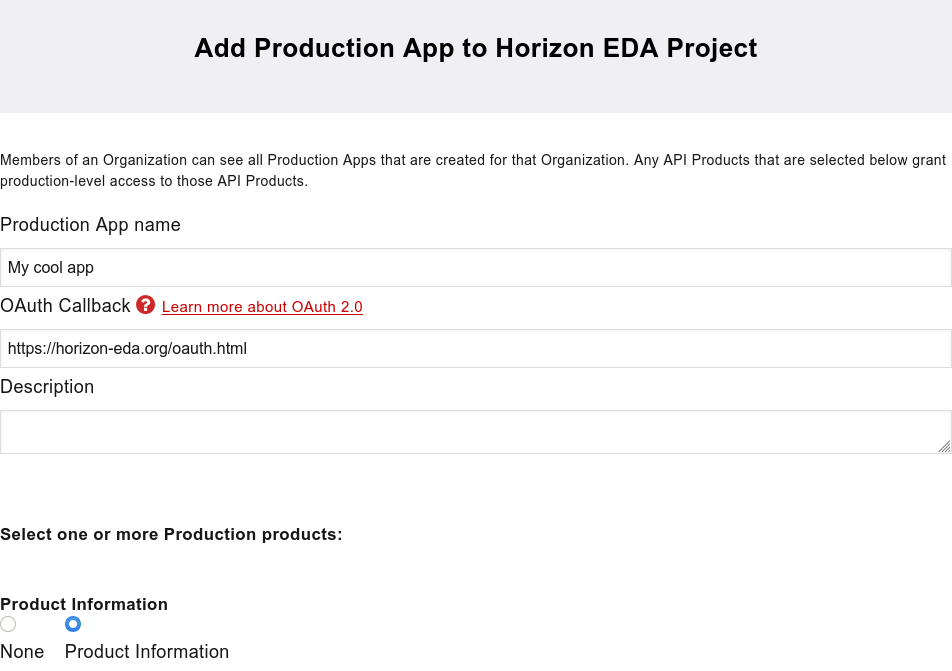
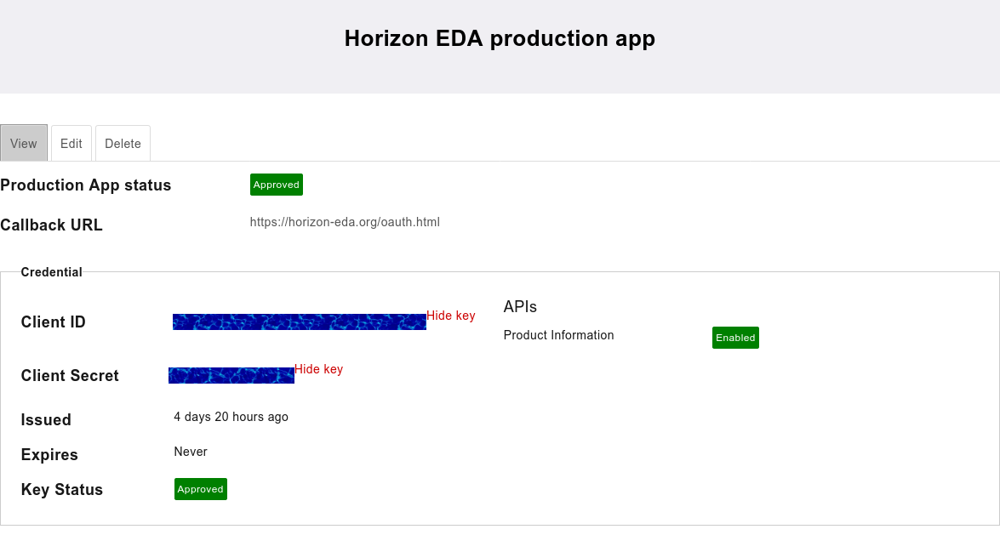
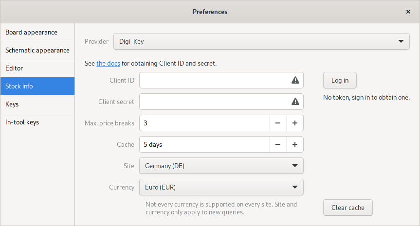

Digi-Key API integration
========================

For displaying stock information in part browsers, Horizon EDA can make 
use of Digi-Key's API. To use it, you need to register an application 
with Digi-Key.

Registering 
-----------

Go to `developer.digikey.com/teams 
<https://developer.digikey.com/teams>`_ and create an organisation, 
the name doesn't matter.

With the organisation in place, click on "Production Apps" in the 
organisations overview and create a new production app. Set 
``https://horizon-eda.org/oauth.html`` as the OAuth Callback. Name and 
description don't matter. Select the "Product Information" product and 
create the app.

Click on the newly-created app and paste the Client ID and Secret into 
the preferences.

Logging in
----------

Finally, you need to log in to get the tokens required to access the 
API. Do so by clicking the "Log in" button and following the 
instructions in the window that opens.
