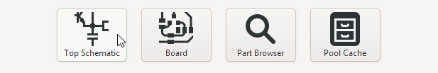
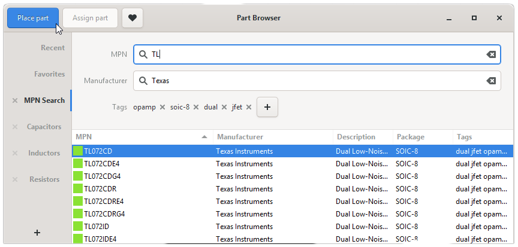
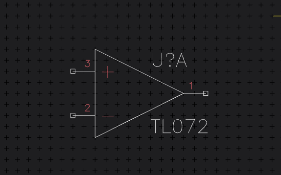
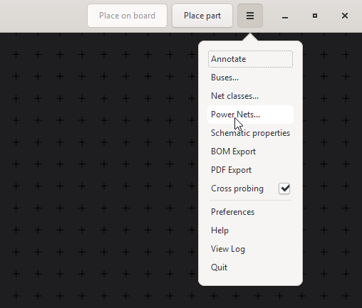
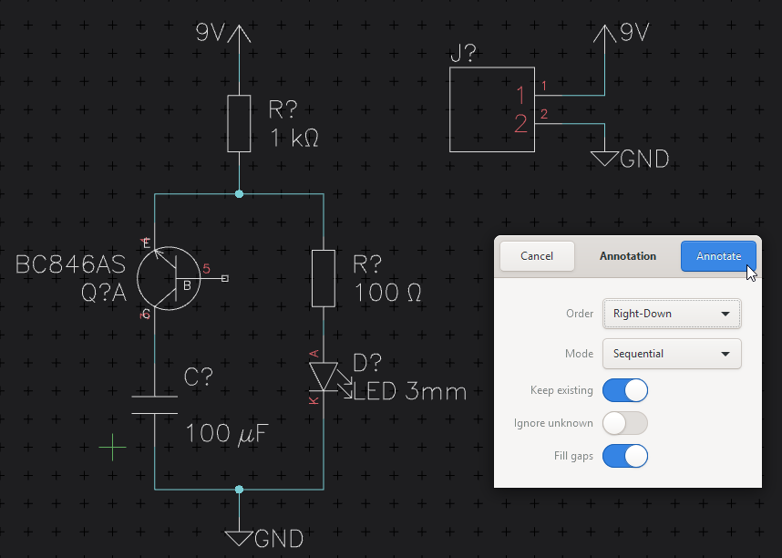
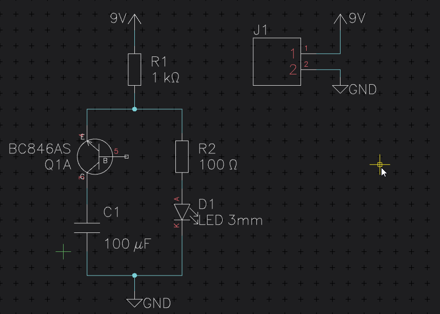

Draw a Schematic
================

In the Project Manager click on the Top Schematic button, to open the Schematic editor:

Placing Parts
~~~~~~~~~~~~~

You can then start placing parts by clicking the "Place Part" button in the top bar, or by simply typing :kbd:`p p` (remember it as "Place Part"). This opens the Part Browser, where you can search your whole pool for the Parts you need and place them on the schematic.

Connecting Parts
~~~~~~~~~~~~~~~~

Once you placed parts you can activate the "Draw net line" tool by typing :kbd:`n` and drawing the connections. You can also simply drag out a pin and beginn connecting pins:

Basic Movement
~~~~~~~~~~~~~~

You can move parts and nets by selecting them and typing :kbd:`m` or by using the :kbd:`←/↑/↓/→` arrow keys. Rotate with :kbd:`r` and mirror with :kbd:`e`

If you forget any of these keys, just press :kbd:`Spacebar` to open the :doc:`Spacebar Menu <spacebar-menu>` and search for the command you are looking for.

Power Nets
~~~~~~~~~~
Because Circuits make much more sense if you use power nets you can create new power nets by clicking on the entry in the application menu:

In the window that pops up press the "Add power net" button, give the net a name and select a symbol style.

Place power nets with the "Place power symbol" Tool (type :kbd:`p o`).

Annotation
~~~~~~~~~~
Run the Annotation Tool to give all un-annotated parts (signified by the "?" in their reference designator) a propper number. So we go from this:

to this:

Once you are done, click on "Save" so you can start to layout the schematic you just created.

Next: :doc:`Create a Board <create-board>`