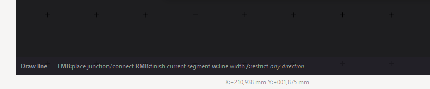
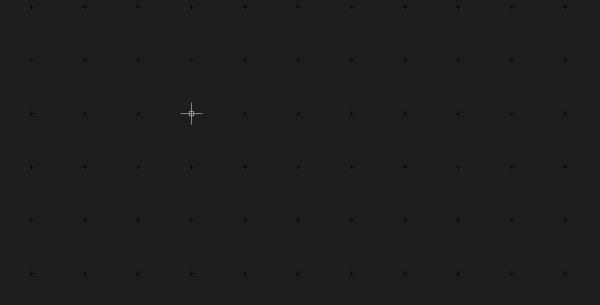
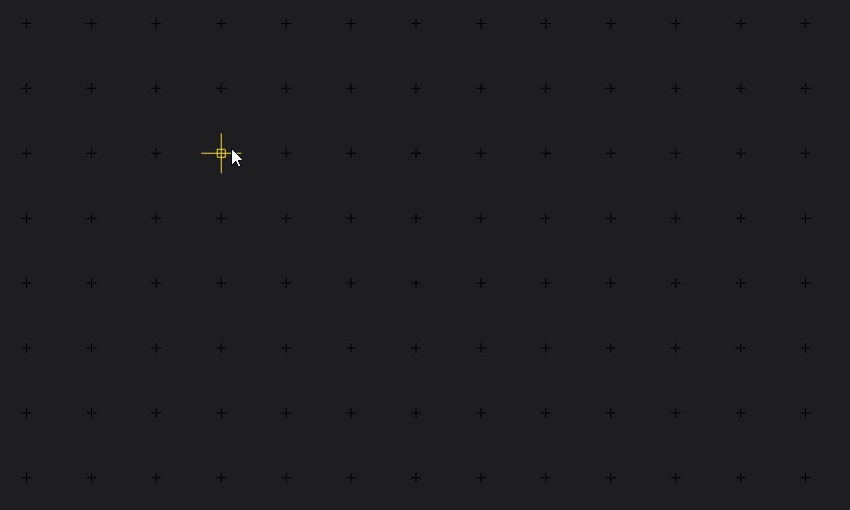

Drawing
=======

The different Editors in Horizon EDA share a set of different Drawing tools. Here you can see the ones available in the Board Editor:

The drawing tools are mainly split in three categories:

- lines
- polygons
- special (like draw track, draw dimension etc.)

Lines are usually used for everything visual (e.g. Silkscreens) while polygones are used for all things where it matters that the thing you draw results in a closed shape (pads, board outlines, package assembly and courtyard layers, etc.)

Draw Line
~~~~~~~~~

To draw a line simply select the "Draw line" Action in the spacebar menu or type the key sequence :kbd:`d l` (think: "draw line") – once you click anywhere, you start the first point of the line right at the place where your manipulator was. You might notice that the point snaps to the grid. If you want a finer grid hold the :kbd:`Alt` key down while placing points. Left mouse button places more and more points, while the right mouse button (or pressing :kbd:`Esc`) will finish the lines.

You might also have noticed the Action Bar at the left bottom of the editor window: 

The Action bar will show additional keys you can press to change the behaviour of the tool. In this case you could press :kbd:`w` to change the width of the stroke or :kbd:`/` to restrict the movment of the manipulator to one direction.

Draw Line Rectangle
~~~~~~~~~~~~~~~~~~~

To save your time, there is also a "Draw line rectangle" Action, which can also be invoked by typing :kbd:`d L`. Per default you first set the rectangles center point and than one of the corner points. By pressing :kbd:`c` you can change this behaviour and set two diagonally opposed corner points instead.

Draw Arc
~~~~~~~~~

The "Draw arc" tool is straightforward it draws line arcs by setting three points (in this order): start point, end point and the center point. You can also use the key sequence :kbd:`d a` to start the tool. If you want your arc to flip direction, press :kbd:`e` before putting down the center point.

Draw Polygon
~~~~~~~~~~~~

When drawing polygons with :kbd:`d y` you can set a series of points by clicking, until you either press :kbd:`Esc` or use the right mouse button. You can make the next edge of the polygon an arc by pressing :kbd:`a`. Just like with the "Draw Arc" tool set the endpoint first and the center point after. Before setting the center point you can flip the arc direction with :kbd:`e` and finally you set the end point of the arc.

Draw Polygon Rectangle
~~~~~~~~~~~~~~~~~~~~~~

.. raw:: html

   <video autoplay loop muted src="_static/draw-polygon-rectangle.mp4"></video> 

Similar to the "Draw line rectangle" Tool there is a "Draw polygon rectangle" tool. Invoke it by typing :kbd:`d Y`. Just like with the according line Tool you can switch between the different draw modes (Center/Corner) by pressing :kbd:`c`. 

There are some differences though: you can set a corner radius by pressing :kbd:`r` and entering a value and you can choose a decoration by pressing :kbd:`d`. These decorations are used to mark the pin 1 on a Package's assembly layer. You can cycle through different decoration positions by pressing :kbd:`p` and set the size of the decoration by pressing :kbd:`s` and entering a value.

Draw Polygon Circle
~~~~~~~~~~~~~~~~~~~

.. raw:: html

   <video autoplay loop muted src="_static/draw-polygon-circle.mp4"></video> 

For ease of use there is also a "Draw polygon circle" Tool. With the first click you set the circles center point and by setting the second point you set the radius. You can also enter a radius by pressing :kbd:`r` and entering a value.

Draw Dimension
~~~~~~~~~~~~~~

.. raw:: html

   <video autoplay loop muted src="_static/draw-dimension.mp4"></video> 

Sometimes it can be useful to add dimension information to certain parts. You can do so by using the "Draw dimension" ActToolion. Start it by typing :kbd:`d d`, selecting the first and the second point and dragging it out. If the numeric value is on the wrong side, you can fix it by selecting the dimension and flipping it with the :kbd:`e` key.

Dimensions can also be set to specified length by selecting the end that's supposed to move and activating the "Enter Datum" tool (press Enter). You can then snap other items to the end points of the dimension.

Next: :doc:`Selection<selection>`
