Feature overview
=======================================

Sane and simple part management
-------------------------------

Easily manage parts, packages and symbols with the :doc:`pool manager <pool-mgr>` (also see :doc:`What is a Pool? <pool-why>`):

.. image:: images/pool-mgr.png

Assign pins to pads in the part editor:

.. image:: images/part-editor.png

Easy part creation
------------------

Simply add pins as they're listed in the datasheet: 

.. image:: images/part-wiz-pads.png

Horizon also ships with script templates for importing industry-standard
formats like IBIS saving you the tedious work of typing what's in the
datasheet.

Easy package creation
---------------------

Get a head start on creating packages by choosing from over 20
IPC-compliant footprint presets:

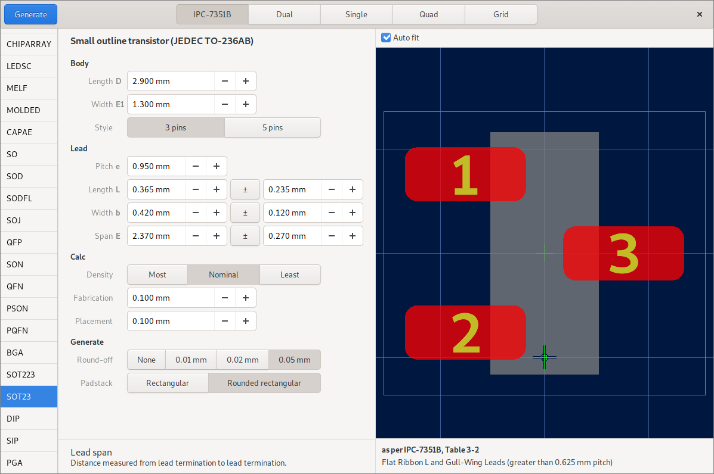

Importing KiCad footprints is supported as well.

Loves beginners and power users alike
-------------------------------------

Just press the spacebar and get a list of all the actions you can perform. These actions can be bound to customizible single key shortcuts or to vim-like multi key sequences.

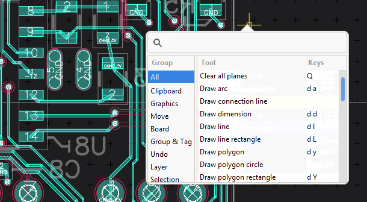

A schematic editor that knows what you're doing
-----------------------------------------------

Schematics aren't just about lines and labels. Horizon's schematic
editor knows about nets and asks you when merging them: 

.. image:: images/net_merge.png

It places junctions where they should be: 

.. image:: images/net.gif

It also reorients texts automatically, so you don't end up with
hard-to-read reference designators: 

.. image:: images/text-align.png

Buses aren't foreign to horizon either: 

.. image:: images/buses.png

Interactive router with online DRC
----------------------------------

By using the interactive router originally developed for KiCad, routing
tracks becomes a breeze. Of course, it respects your design rules. 
Routing differential pairs is supported as well.

.. image:: images/routing.png

Powerful rules
--------------

With powerful and flexible rules, horizon can check and adjust your
design to meet its constraints: 

.. image:: images/rules.png

If something doesn't meet your rules, horizon exactly tells what's wrong
in which place:

.. image:: images/drc.png

Multithreaded DRC makes use of all CPU cores:

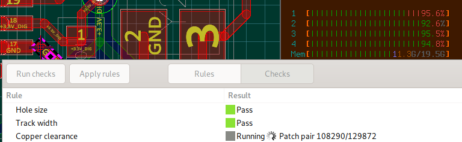

Interactive length tuning
-------------------------

Interactively measure and tune individual tracks, differential pairs or 
buses: 

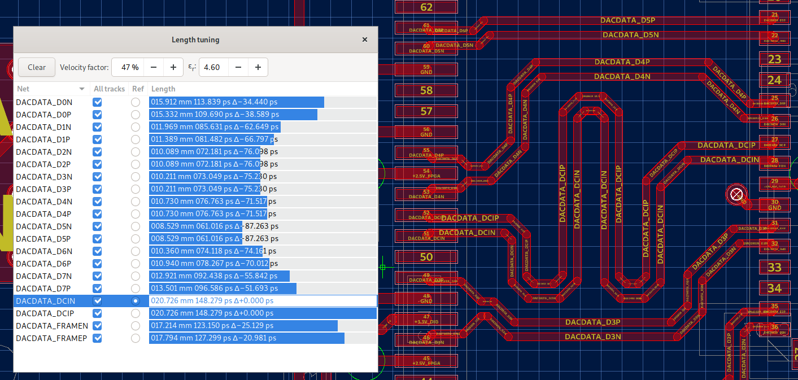

Parametric Search
-----------------

Parametric part search helps you to quickly find passives:

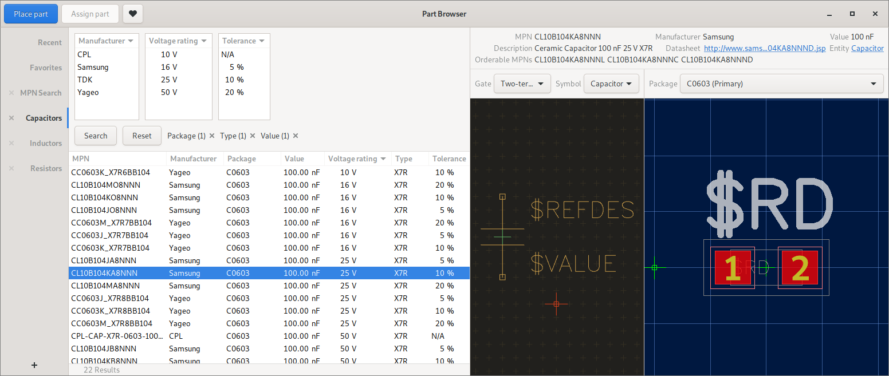

Stock information
-----------------

Real-time stock information powered by `Kitspace's partinfo 
<https://github.com/kitspace/partinfo>`_:

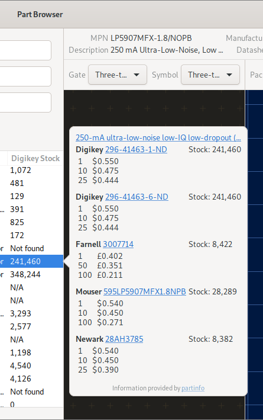

Smart Head-up Display
---------------------

Instantly know what you're looking at with direct link to datasheets:

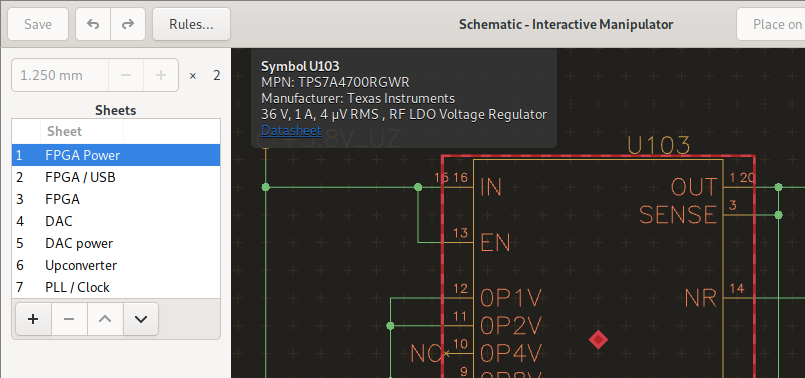

Measures pad distance and much more:

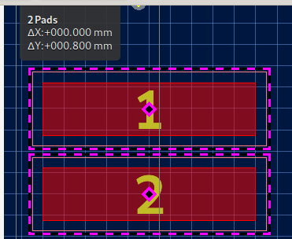

Industry-standard fabrication outputs
-------------------------------------

When your design is ready for fabrication, simply export
industry-standard RS-274X gerber and NC-Drill files:

.. image:: images/fab-out.png

Mechanical CAD integration
--------------------------

Extend packages into the 3rd dimension by adding a 3D model in
industry-standard STEP format:

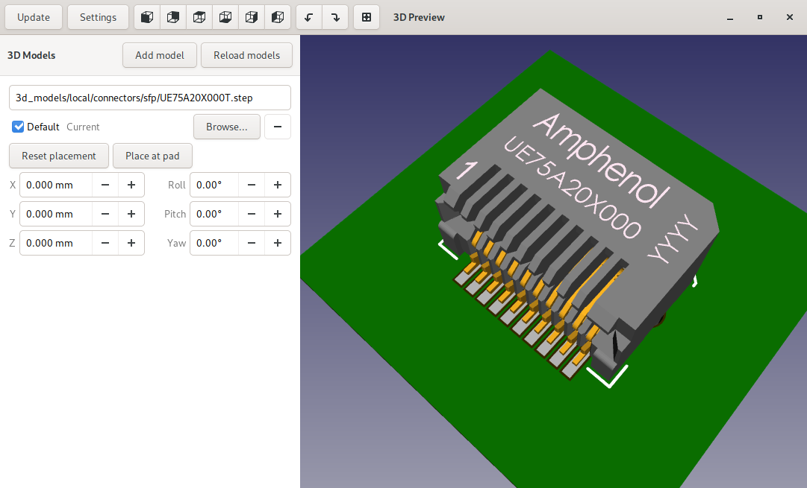

Look at your board as if you were holding it in your hands to make sure 
everything fits as intended:

.. image:: images/3d.png

When the design is done, export the board and all models as STEP file 
for use in mechanical CAD:

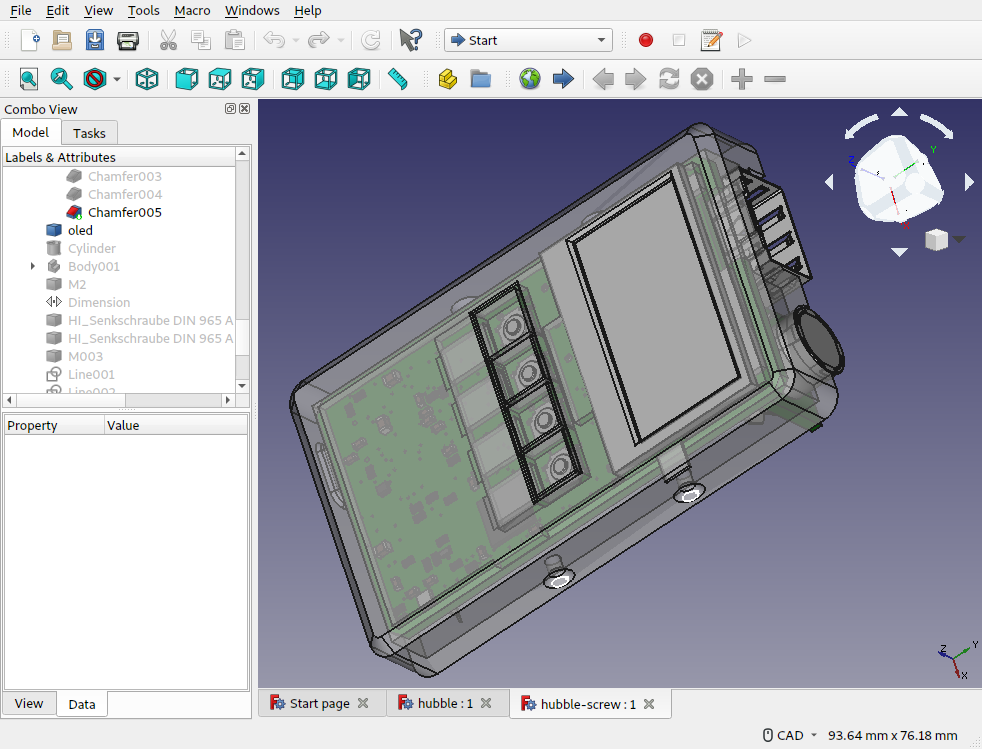

Make it yours
-------------

Decoration affects people, and people are different – do your own thing or select from the existing color schemes.

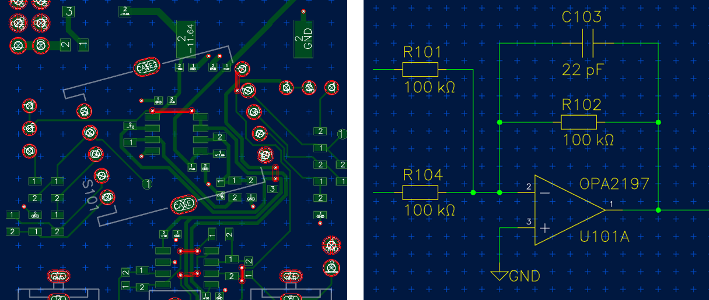
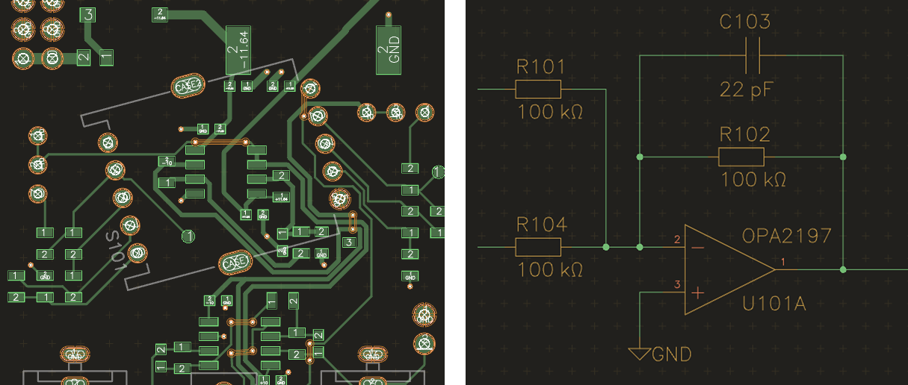
.. image:: images/colorscheme3.png
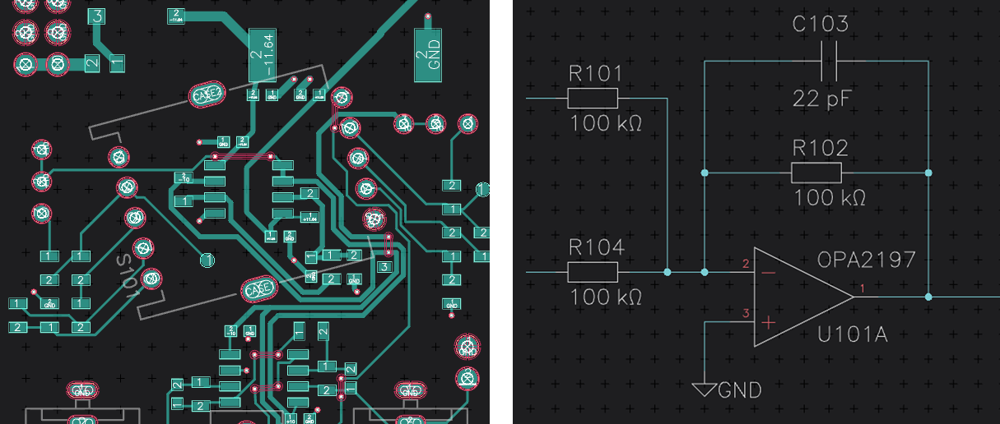
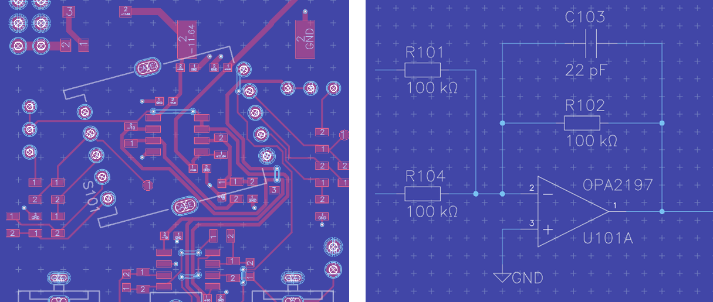

Keyboard shortcuts are fully customizable as well.

There's much more
-----------------

-  OpenGL-accelerated rendering
-  Undo/redo
-  Copy/paste, even between instances
-  Filled planes
-  Arbitrary pad shapes
-  Import DXF Artwork
-  Export a Bill of Materials (BOM)
