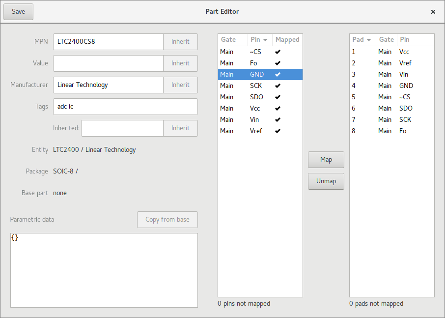
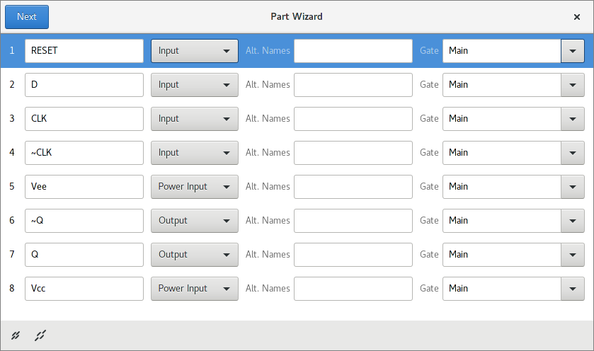
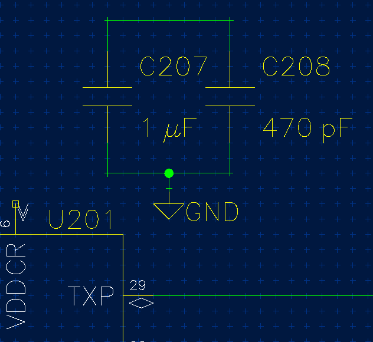
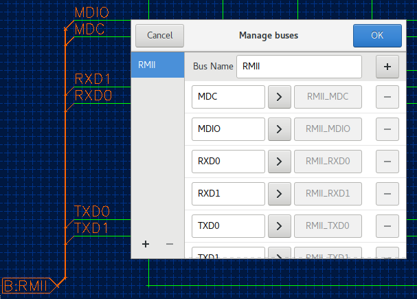
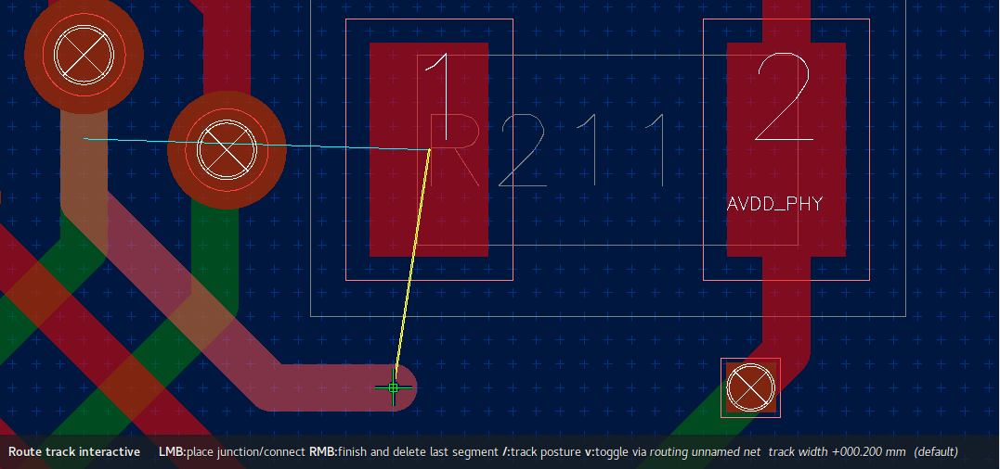
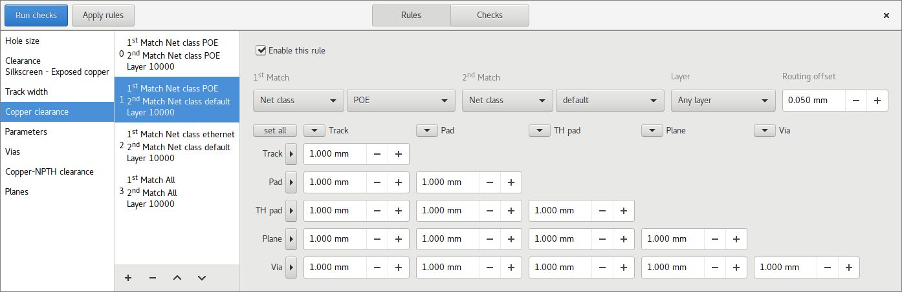
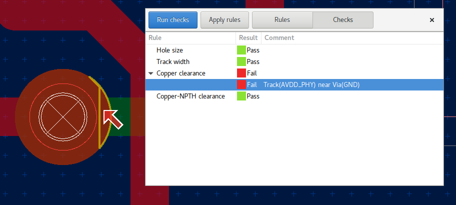
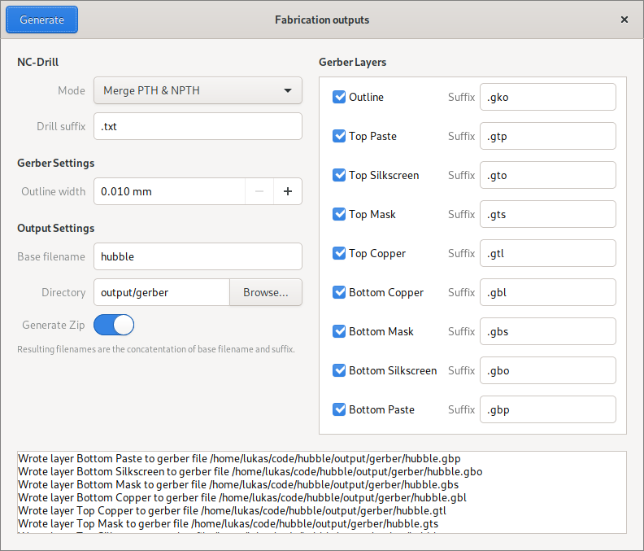
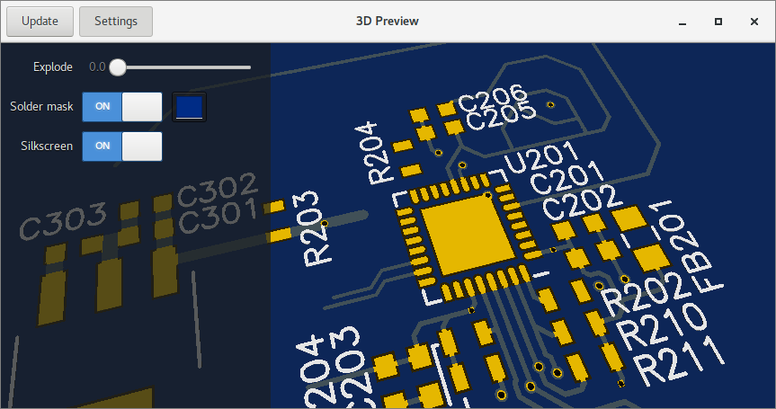

Feature overview
=======================================

Sane and simple part management
-------------------------------

Easily manage parts, packages and symbols with the pool manager:

.. image:: images/pool-mgr.png

Assign pins to pads in the part editor:

Easy part creation
------------------

Simply add pins as they're listed in the datasheet: 

Horizon also ships with script templates for importing industry-standard
formats like IBIS saving you the tedious work of typing what's in the
datasheet.

A schematic editor that knows what you're doing
-----------------------------------------------

Schematics aren't just about lines and labels. Horizon's schematic
editor knows about nets and asks you when merging them: 

.. image:: images/net_merge.png

It places junctions where they should be: 

It also reorients texts automatically, so you don't end up with
hard-to-read reference designators: 

.. image:: images/text-align.png

Buses aren't foreign to horizon either: 

Interactive router with online DRC
----------------------------------

By using the interactive router originally developed for KiCad, routing
tracks becomes a breeze. Of course, it respects your design rules.

Powerful rules
--------------

With powerful and flexible rules, horizon can check and adjust your
design to meet its constraints: 

If something doesn't meet your rules, horizon exactly tells what's wrong
in which place:

Industry-standard fabrication outputs
-------------------------------------

When your design is ready for fabrication, simply export
industry-standard RS-274X gerber and NC-Drill files:

3D View
-------

Look at your board as if you were holding it in your hands. Using the
explode slider, you can pull the layers apart.

There's much more
-----------------

-  OpenGL-accelerated rendering
-  Unlimited undo/redo
-  Copy/paste, even between instances
-  Filled planes
-  Differential pair routing
-  Arbitrary pad shapes
