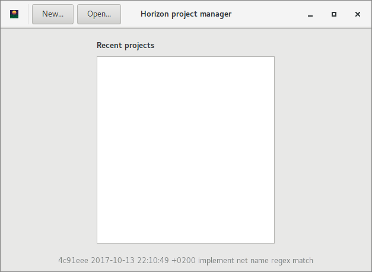
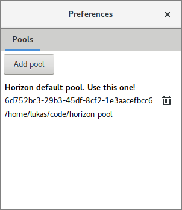

Getting Started
===============

So you wanna give horizon a test drive? Great! Here's how.

Get horizon
-----------

Windows
~~~~~~~

Grab the latest build from `AppVeyor CI <https://ci.appveyor.com/project/carrotIndustries/horizon/build/artifacts>`_ 
and unzip it somewhere. Note that these are 64bit binaries. In case a
build is still running or someone broke the build, you can download past
builds from
`the build history <https://ci.appveyor.com/project/carrotIndustries/horizon/history>`_
(click on artifacts to get the zip)

Linux
~~~~~

See :doc:`build-linux` for
instructions on how to build horizon on linux.

Get the pool
------------

Git
~~~

If you're familiar with git, just clone clone
`horizon-pool <https://github.com/carrotIndustries/horizon-pool/>`_
somewhere and you're good to go. You're supposed to use git to keep your
local copy up to date and submit new parts.

Pool manager
~~~~~~~~~~~~

Don't know how to git? No problem! Double-click ``horizon-eda.exe`` or
launch ``./horizon-eda`` from your shell and click on 'Download...' to
download the pool. The default pool ``carrotIndustries/horizon-pool`` is
the one you want to use. The pool manager will assist you in keeping
your pool up-to-date, see the "Remote" tab. It will also assist you by
creating a fork, branches, commits and pull requests on your behalf so
you can contribute to the pool without any git knowledge.

Create a new project
--------------------

Double-click ``horizon-eda.exe`` or launch ``./horizon-eda`` from your
shell. You should now see a window similar to this one (screenshot needs
to be updated):

Click the application icon in the top left corner and open the
preferences dialog. Add the pool you just downloaded by pointing it to
the ``pool.json`` in the pool's directory. When you're done the
preferences dialog should look like this:

Now, hit "New..." to create a new project.

Schematic
---------

After having created your new project, open the schematic editor and
place some parts and connect these.

Board
-----

After placing and connecting some parts in the schematic editor, click
save in the schematic editor and open the board editor from the project
manager. Place packages on the board using by typing "pp". To route
tracks, type "x". To bring new components from the schematic to the
board, click save in the schematic editor followed by 'reload netlist'
in the board editor.

Example project
---------------

Instead of starting your own project, you can also download the `design
files for an X-Band
transmitter <https://github.com/carrotIndustries/x-band-tx>`__. To open
it, point the project manager to the ``ddstx.hprj`` file. Make sure that
you extract all the files contained in that repository.
