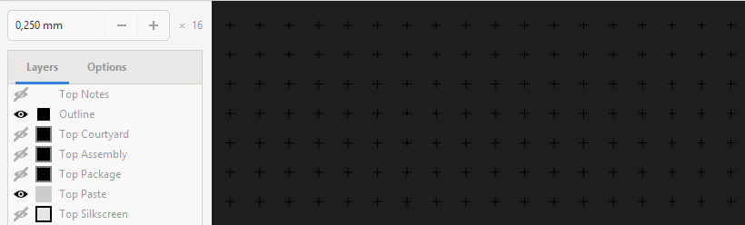
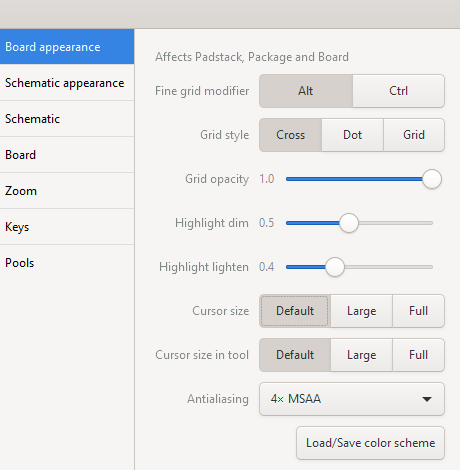

Grid
====

All movments in Horizon happen on the grid. By holding :kbd:`Alt` you get a finer grid (by a factor of 10).

You can change the size of the grid by changing the value in the numeric field on the top left of the window. Note that depending on a zoom level your grid may be resized by factors of two.

You can enter basic math operations into *any* numeric field in horizon, this makes it easy to divide a value by two, multiplying something by a certain factor, or adding a value to a coordinate to create a fixed offset.

You can change the appearance of the grids and the cursor in the Preferences:

Next: :doc:`Drawing<drawing>`