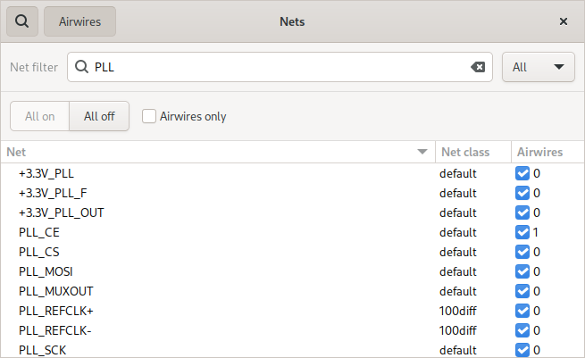
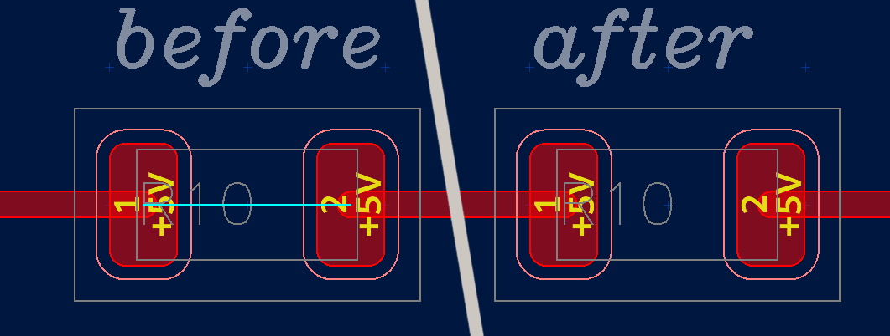

Board Editor
============

To launch the schematic editor click on “Board” in the project manager.

The board editor keeps an internal copy of the netlist. To update the
netlist, click "Save" in the schematic editor for writing the netlist to
disk, then click on ’reload netlist’ or re-open the board editor or use the action "Save and reload netlist" in the the schematic editor.

Planes
------

For adding planes, first draw a polygon of the desired shape in a copper
layer. Then use the “Add plane” tool to assign it a plane. Planes with
lower fill order will get filled first. To override the connection style (solid or thermal relief), create a Thermal rule.

Vias
----

To place a via while routing, press :kbd:`v`. The "Layer pairs" rule defines which layer the router switches to. To change the size of vias, define a matching via rule.

You can also place vias not connected to any track with the "Place via" tool.

Importing logos
---------------

The preferred way to import logos and other artwork into the board editor by means of the DXF import tool. Since Horizon EDA doesn't support bezier curves, convert these to lines first. Inkscape's "Modify Path/Flatten Beziers" extension works great for this. If you require filled polygons, use the "Line loop to polygon tool" to convert line loops to polygons. Use the "Scale" tool to adjust the imported logo to the size you need.

Board outline
-------------

Define the board outline by drawing polygons on the Outline layer. The board must be representable by a single polygon with zero or more holes, that means:

- There must one polygon that encloses all others
- These other polygons are holes
- Hole polygons must not intersect or touch each other

The "Outline" rule checks that these requirements are met. Do not use arcs or lines on the outline layer. Put any other outline-related information such as indications for v-scores on the "Outline Notes" layer. The Gerber export merges the "Outline" and "Outline Notes" laters.

Reconnecting tracks without a net
---------------------------------

For a track to be assigned a net, is has to be connected to a pad or a via either directly or indirectly. If that's not the case, tracks are assigned to no net and turn orange. Use the "draw track" tool to reconnect the track to a net. 

Diffpairs
---------

To create a diffpair see :ref:`Schematic Diffpairs<Schematic Diffpairs>` . Before
routing a diffpair, create a diffpair rule specifying track width and
gap. To route a diffpair, use the “Route diff. pair” tool.

Nets window
-----------

You can open the nets window from the "View & Selection" menu in the bottom bar or by searching for it in the spacebar menu.

Hide Airwires
^^^^^^^^^^^^^

Uncheck the checkbox in the airwires column to hide the airwires of a net. You can also select more than one net and use the context menu to turn off or on airwires for multiple nets at once.

Recolor nets
^^^^^^^^^^^^

Right click on one more selected nets to open the context and assign a specific color to nets.

Shorted pads
------------

When using zero-ohm resistors or other components for connectivity, there's still an airwire across the component since Horizon EDA isn't aware that the part is a short circuit.

Create a "Shorted pads" rule to specify that the pads of a part are electrically connected.

.. _net-ties-brd:

Net ties
--------

Once a net tie has been defined on the :ref:`Schematic<net-ties-sch>`, it can be added to the board using the "Draw net tie tool". A net tie on the board behaves similar to a track of the primary net and are treated as such by track width, copper clearance and other rules. Since net ties go from junction to junction, they can be joined with other tracks.

The "Net ties" rule checks that all net ties that are defined on the schematic are drawn on the board and connect to the correct nets. The copper clearance checks ignore the clearance violation caused by the net tie, but still flag clearance violations caused by other objects of the net.

Screenshot
----------

.. image:: images/imp-brd.png
