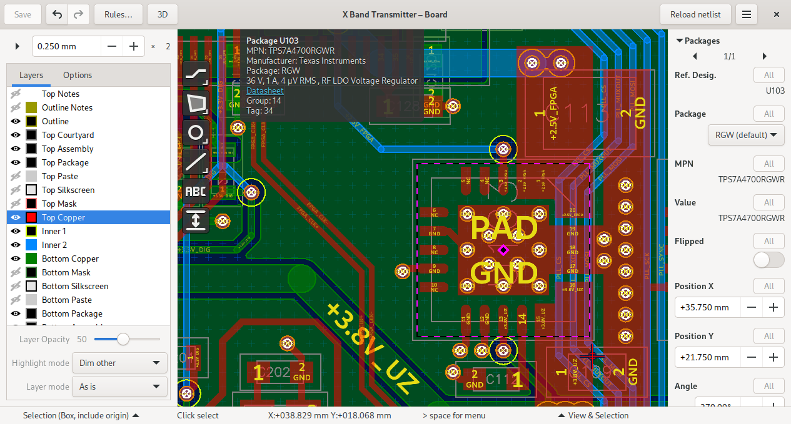

Board Editor
============

To launch the schematic editor click on “Board” in the project manager.
Same as all other graphical editors, horizon’s board editor is based on
:doc:`imp` 

The board editor keeps an internal copy of the netlist. To update the
netlist, hit ‘Save" in the schematic editor for writing the netlist to
disk, then click on ’reload netlist’ or re-open the board editor.

Planes
------

For adding planes, first draw a polygon of the desired shape in a copper
layer. Then use the “Add plane” tool to assign it a plane. Planes with
lower priority will get filled first.

Vias
----

Before placing a via, create a default rule for vias in the “Rules”
window and assign it the desired padstack.

Diffpairs
---------

To create a diffpair see :ref:`Schematic Diffpairs<Schematic Diffpairs>` . Before
routing a diffpair, create a diffpair rule specifying track width and
gap. To route a diffpair, use the “Route diff. pair” tool.

Screenshot
----------

