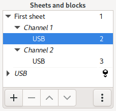
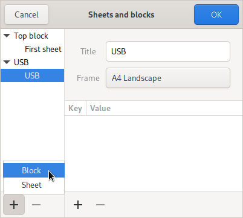
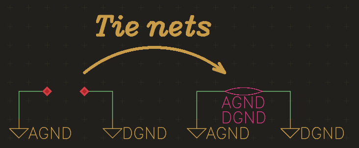

Schematic Editor
================

To launch the schematic editor click on “Top Schematic” in the project
manager. 

Placing parts
-------------

To place parts, open the part browser either by typing :kbd:`p p` (place part) or clicking on the corresponding icon in the project manager. Once a part has been placed, it can be replaced by a part of the same entity by selecting it and using the "Assign part" button in the part browser window.

See :doc:`project-pool` for how to get updated items from pools.

Nets and net segments
---------------------

Unlike some other schematic entry tools, horizon’s actually knows about
nets and isn’t just about drawing lines that will eventually be
transformed into nets when generating the netlist. A net may be
represented by one or more net segment. A net segment is a set of net
lines, junctions, pins, etc. all connected by net lines. Since the
editor tracks which net segments belongs to which net, it provides
feedback when an operation is about to merge two nets.

So when you see a net in the property editor after selecting a net line,
the net in the property editors is the “whole” net and not just the net
segment. That’s why renaming a net doesn’t change connectivity. To
connect the pins on a net segment to a different net, use the “Move net
segment to other/new net” tool.

A net label just displays the name of the net it is connected to and
doens’t set net names. To alert you about inconsistencies in the
schematic that could result in unexpected connectivity, the schematic
editor places warnings on the offending items.

Power symbols
-------------

The easiest way of creating a power net is using the “Manage Power Nets”
Tool available from the hamburger menu. Then, use the tool “place power
symbol”, to place a power symbol for this net. Power symbols force their
net on the connected net segment. You can select from three styles of
Power symbols in the aforementioned tool. The Antenna and Dot symbols
can be placed either pointing up or down. The GND symbol can only point
downwards.

Buses
-----

To group related nets, use Buses. After creating a bus, add members to
it. You can either assign existing nets or automatically name the newly
created net by clicking on the arrow button next to it.

.. _Schematic Diffpairs:

Diffpairs
---------

To create a differential pair, select the two nets you want to become a
pair and run the “Set diff. pair” tool. You can also select one net and
you’ll be asked for the other net. To decouple the nets, use the “Clear
diff. pair” tool. It’s recommended to assign both nets a netclass such
as “100diff” so you can match them in the rules.

To board
--------

To facilitate placing packages on the board, simply select the
corresponding symbols and activate the "place on board" action by pressing :kbd:`p b`.This will switch to the board
editor and launch the “place package” tool with the packages for the
selected symbols. Note that you may need to reload the netlist in the
board editor before doing so to make the board editor pick up new
components.

Hierarchy
---------

Similar to other schematic entry tools, hierarchical schematics are made up of blocks that can be instantiated. To create a new block, open the sheets and blocks dialog by clicking on the three dots in the sheet list.

In that dialog, click on the plus icon in the block list to create a new one.

All blocks, regardless of whether they're instantiated or not, appear below the sheets in the sheet list. Select a block to edit its symbol. Clicking on the insert icon next to a block instantiates it on the current sheet.

Connectivity to the rest of the schematic can be established either through ports or power nets. Power nets are global to the entire schematic. Since it's good practice to name ports identical to nets, ports aren't separate objects in Horizon EDA. Instead, a port is defined by setting the "is port" property on an existing net. This can be done either by toggling the appropriate switch in the properties of a net in the right sidebar or through the port nets dialog. Buses are local to the block they're defined in. As of now, there is no provision for bus ports. Net classes and net names are set in each block individually and don't take into account connectivity made by ports. When the netlist gets flattened for use in the board editor, the net class and name from the topmost net get used.

Blocks can be edited either inside or outside of the hierarchy. To edit a block within the hierarchy, double-click any of its placed block symbols or select one of its sheets in the top part of the sheet and block list. Changes to reference designators or "do not populate" flags are specific to the selected instance.

When selecting a sheet of a block directly from the list of blocks in the lower part of the sheet and block list, reference designators and "do not populate" can't be modified as they're instance-specific. Aside from that, there's no difference between editing a block inside or outside of the hierarchy. The current mode is shown in the bar that sits above the schematic viewport.

Deleting a block won't delete its schematic and block from disk. Right now, there isn't any way to do so, so you'll manually need to delete the block from the `blocks` directory in the project if you want it to be gone.

.. _net-ties-sch:

Net ties
--------

Use net ties to electrically connect two nets. One use case could be connecting analog and digital ground nets.

To create a net tie, select two junctions, one of each net, that should be tied and invoke the "tie nets" tool:

The net that's listed first (AGND in this case) is the primary net of a net tie. See :ref:`Board Net ties<net-ties-brd>` for what that means and how to represent net ties on the board. The "flip net tie" tool swaps primary and secondary net of a net tie.

Screenshots
-----------

.. figure:: images/imp-sch.png
   :alt: imp sch
