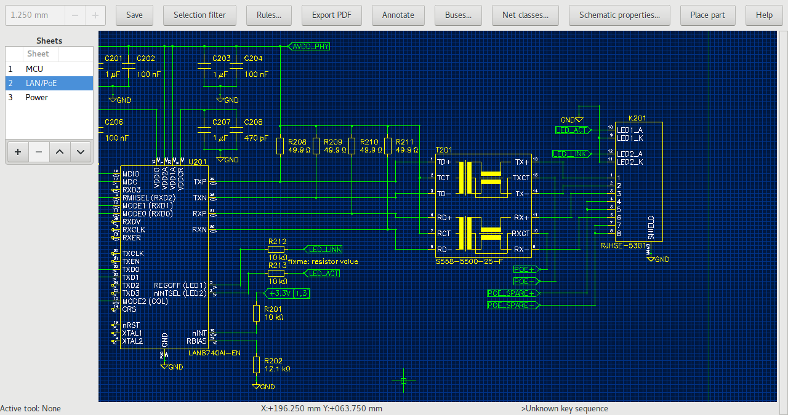

Schematic Editor
================

To launch the schematic editor click on “Top Schematic” in the project
manager. 

Placing parts
-------------

To place parts, open the part browser either by typing :kbd:`p p` (place part) or clicking on the corresponding icon in the project manager. Once a part has been placed, it can be replaced by a part of the same entity by selecting it and using the "Assign part" button in the part browser window.

Nets and net segments
---------------------

Unlike some other schematic entry tools, horizon’s actually knows about
nets and isn’t just about drawing lines that will eventually be
transformed into nets when generating the netlist. A net may be
represented by one or more net segment. A net segment is a set of net
lines, junctions, pins, etc. all connected by net lines. Since the
editor tracks which net segments belongs to which net, it provides
feedback when an operation is about to merge two nets.

So when you see a net in the property editor after selecting a net line,
the net in the property editors is the “whole” net and not just the net
segment. That’s why renaming a net doesn’t change connectivity. To
connect the pins on a net segment to a different net, use the “Move net
segment to other/new net” tool.

A net label just displays the name of the net it is connected to and
doens’t set net names. To alert you about inconsistencies in the
schematic that could result in unexpected connectivity, the schematic
editor places warnings on the offending items.

Power symbols
-------------

The easiest way of creating a power net is using the “Manage Power Nets”
Tool available from the hamburger menu. Then, use the tool “place power
symbol”, to place a power symbol for this net. Power symbols force their
net on the connected net segment. You can select from three styles of
Power symbols in the aforementioned tool. The Antenna and Dot symbols
can be placed either pointing up or down. The GND symbol can only point
downwards.

Buses
-----

To group related nets, use Buses. After creating a bus, add members to
it. You can either assign existing nets or automatically name the newly
created net by clicking on the arrow button next to it.

.. _Schematic Diffpairs:

Diffpairs
---------

To create a differential pair, select the two nets you want to become a
pair and run the “Set diff. pair” tool. You can also select one net and
you’ll be asked for the other net. To decouple the nets, use the “Clear
diff. pair” tool. It’s recommended to assign both nets a netclass such
as “100diff” so you can match them in the rules.

To board
--------

To facilitate placing packages on the board, simply select the
corresponding symbols and hit “To board”. This will switch to the board
editor and launch the “place package” tool with the packages for the
selected symbols. Note that you may need to reload the netlist in the
board editor before doing so to make the board editor pick up new
components.

Screenshots
-----------

