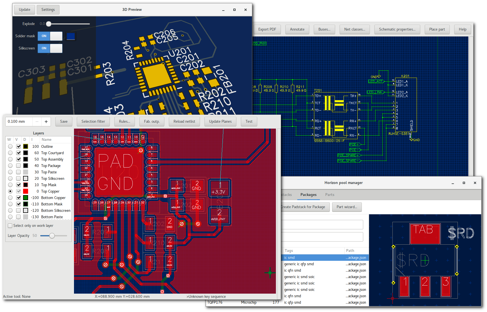

Horizon EDA documentation
=========================

Horizon EDA is an **Electronic Design Automation** package supporting an integrated end-to-end workflow for printed circuit board design including parts management and schematic entry. 

Take a look at the :doc:`top features <feature-overview>`, just :doc:`try it out <installation>` or begin by :doc:`reading from the start<why-another-eda-package>`.

.. toctree::
   :maxdepth: 1
   :caption: About:

   why-another-eda-package
   feature-overview
   non-goals
   made-with

.. toctree::
   :maxdepth: 2
   :caption: Getting Started:

   installation
   pool-setup
   new-project
   draw-schematic
   create-board
   example-project
   digikey-api
   faq

.. toctree::
   :maxdepth: 1
   :caption: Basic Editor Usage:

   tools
   spacebar-menu
   grid
   entries
   drawing
   selection
   move
   layers
   tips-and-tricks

.. toctree::
   :maxdepth: 2
   :caption: Schematic Editor:

   imp-sch

.. toctree::
   :maxdepth: 1
   :caption: Board Editor:

   imp-board
   copy-layout-placement
   backannotation
   rules

.. toctree::
   :maxdepth: 2
   :caption: Pool:

   pool-why
   pool-elements
   project-pool
   pool-mgr
   create-package
   cursed-footprints
   pool-contribute
   

.. toctree::
   :maxdepth: 1
   :caption: Advanced Topics:

   build-win32
   build-linux
   build-freebsd
   parameter-programs
   theory-of-operation
   cli-usage
   python
   version

