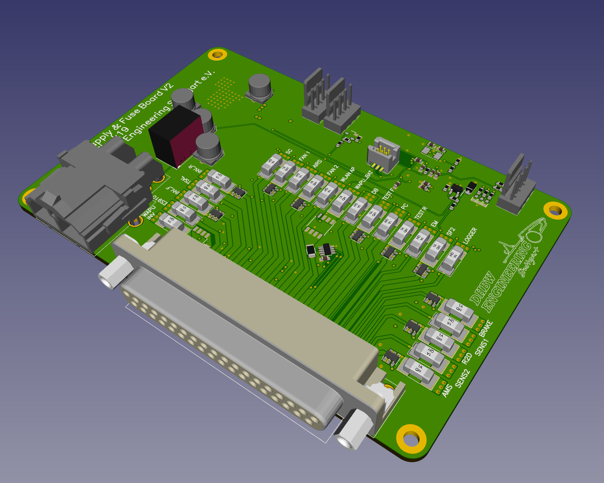
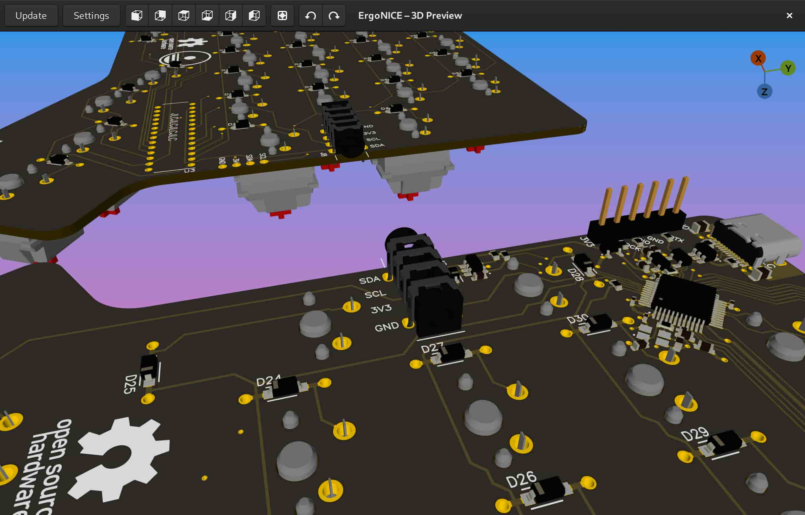

Made with Horizon EDA
=====================

This list of projects made with Horizon EDA. Open a `Pull request <https://github.com/horizon-eda/horizon-docs/pulls>`_ if you want to see your project on this page.

X-Band Transmitter
~~~~~~~~~~~~~~~~~~

`Repository <https://github.com/carrotIndustries/x-band-tx/>`__

.. image:: images/made-with/x-band-tx.png

Hubble (SFP Multitool)
~~~~~~~~~~~~~~~~~~~~~~

`Repository <https://github.com/carrotIndustries/hubble/>`__

.. image:: images/made-with/hubble.png

Fuse board of the Formula Student Racecar "eSleek19" of DHBW Engineering Stuttgart e.V.
~~~~~~~~~~~~~~~~~~~~~~~~~~~~~~~~~~~~~~~~~~~~~~~~~~~~~~~~~~~~~~~~~~~~~~~~~~~~~~~~~~~~~~~

ErgoNICE (Split Mechanical Keyboard)
~~~~~~~~~~~~~~~~~~~~~~~~~~~~~~~~~~~~

`Repository <https://codeberg.org/valpackett/ergonice>`__
`Article <https://val.packett.cool/blog/ergonice/>`__

