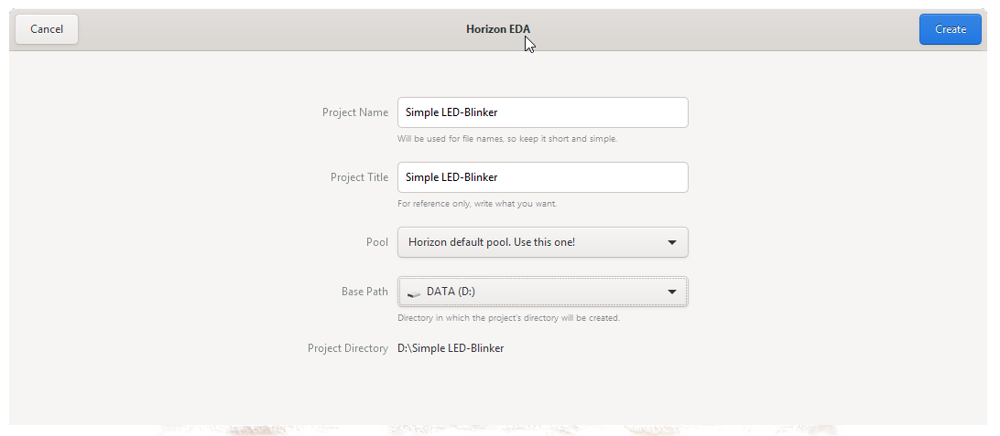
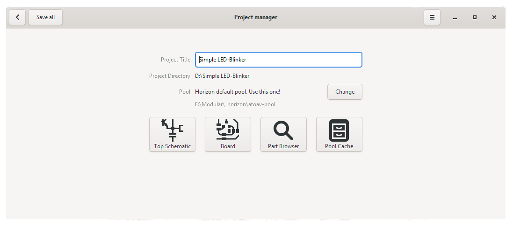

Create a new Project
====================

When you start Horizon EDA you should see a window like this one

.. image:: images/prj-mgr.png

Make sure you have a pool set up and added

Click the menu icon in the top right corner and open the
preferences dialog. In the Pool section selected the pool you want to use for your project. If you don't have a pool here you can open a pools ``pool.json`` by clicking on "Open..." in the main window. When you're done the
preferences dialog should look like this:

.. image:: images/pool-prefs.png

Now, hit "New..." and then "Project" to create a new project.

In the Project Dialogue Window you can select a project name and a location where you want to store the project folder. Additionally you can change the active pool: 

In the Project manager window that opens now, you can create a Schematic, a Board, Browse for Parts or Manage the Pool Cache. 

The Pool Cache stores a copy of all parts that you used in you project and helps you to protect your projects from outside changes (e.g. by updates in the Pool). When you *want* to update the parts, or remove unused parts you can do so in the Pool Cache Window.

Next: :doc:`Draw a Schematic <draw-schematic>`

