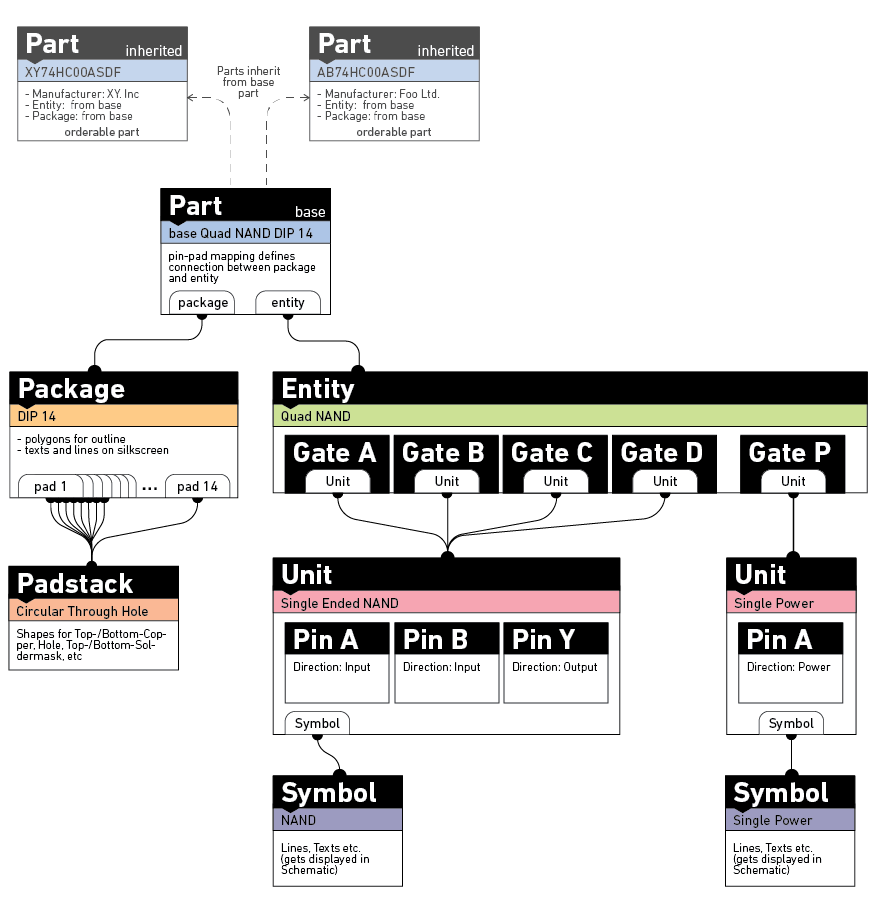

Why a Pool?
===========

What's a pool
-------------

So what's all this Pool stuff anyhow? Many EDA packages organize
packages, symbols and the like in libraries. These are often messy 
and version-controlling these is difficult since many independent 
parts are put in a single file. Especially the latter often makes collaboration 
difficult.

With horizon, there are no libraries. Instead all the non-project elements
(symbols, etc.) are stored in a pool. Similar to the "central library"
approach common among the more enterprisey EDA packages. 

However the new thing here is, that a Part within this pool is *composed* of 
multiple other elements, that handle different aspects of the Parts nature:

For example you can define one "Quad NAND" Entity and reuse it for each new
NAND Part, without having to redefine the Gates time and time again. The Quad NAND Entity in turn is composed of multiple Single Opamp NAND Units
and one Power Unit. If you now want to make a Dual NAND Entity, you can just reuse
the already existing Units and this guarantees you consistency with the other NAND
parts in your pool. 

Organisation in the file system
-------------------------------

Each of these elements that make up a Part is stored in a single json file in the
respective directory, i.e. /symbols, /entities, /units, /parts, etc. The exact location within these directories is irrelevant, as long the json file is stored 
in the correct directory: Symbols in /symbols, Units in /units and so on.
Additionally it is important for the files to end in ".json" so they can be
picked up by the pool updater. To make searching for parts more
convenient, the metadata of all json files is aggregated into a sqlite
database. This is what the 'Update pool' button in the Pool Manager is
for.

Naturally a pool with a focus on composition is organized using tags instead of a hierarchical system since these often lead to (unnecessary) confusion over aspects like whether to group parts by manufacturer or other attributes.

Including other pools
---------------------

Apart from containing items, a pool can also include other pools to get access to their items. To include a pool, first add it in the "Pools" window available from the menu on the top right in the pool/project manager and then move it to the "Pools included" list in the "Settings" tab in the pool manager. The order of included pools becomes relevant when an item of identical type and UUID exists in multiple included pools. Items from pools that are higher up in the list take precedence over items from pools that are lower down in the list.

When a pool includes at least one pool, pool browsers show a colored box in front of items to indicate their source. Check the tooltip for the meaning of each color.

Contributing
------------

Although you can create your own pool, you are strongly encouraged to use the pool
over at
`https://github.com/horizon-eda/horizon-pool/ <https://github.com/horizon-eda/horizon-pool/>`__.
To add new parts to it, simply submit a merge request. See also: :doc:`Contribute to the Pool <pool-contribute>`
