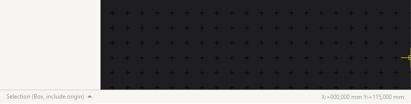

Selection
=========

Selection throughout the Editors of Horizon EDA is very straightforward and there are no surprises here. No matter how basic it seems, the different modes and filters could save you quite some time.

Basics
~~~~~~

.. image:: images/selection.gif

Initially, the "hover select" mode is active. It simply selects the
smallest object under the cursor. Leftclick or drag with the clicked button to select objects permanently. Hit :kbd:`Esc` for returning to hover select mode.

If you want to select multiple things by clicking keep Hit :kbd:`Ctrl` pressed while you click on things – this also works to deselect things you accidentally selected while dragging a selection box.

Selection Mode
~~~~~~~~~~~~~~

You can change how dragging the left mouse button behaves in the lower left corner of the editor window. Available are three different modes (Box, Lasso, Paint) with four different selection characteristics (Auto, Include Origin, Touch Box, Include Box).

Selection Filter
~~~~~~~~~~~~~~~~

If you have to select many things, it can sometimes be handy to only select certain classes of objects. This is what the selection filter is for. You can open it up via the spacebar menu or by pressing :kbd:`Ctrl+i`

Double click on an item to select only that item. Click on the check mark button on the top left to select all items.

Next: :doc:`Moving and the interactive Manipulator<move>`
