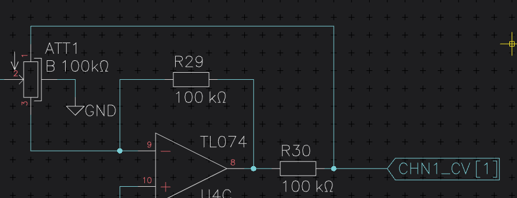

Spacebar Menu
=============

Horizon's Editors rely on fast and intuitive single key shortcuts and key sequences alike. While this is very powerful for those who use it daily, it could be cumbersome for those who just started out or have long periods passing between each of their electronics projects.

In order to make the transition between beginner and power user an easy one, Horizon EDA has a Spacebar Menu, that (hence the name) pops up after you pressed :kbd:`Spacebar`. In this menu all Tools you can select within the Editor's Canvas are listed. To help you getting faster the shortcuts and key sequences are listed alongside the tools. So if you find yourself in the position of having to go to the space bar menu over and over again, you can easily speed up things, by using the short cuts.

You can easily customize these shortcuts in the preferences window.

Next: :doc:`Grid<grid>`