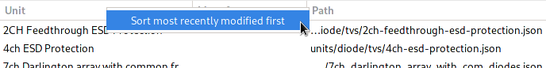

Tips and Tricks
===============

There are quite a few features that make day-to-day usage easier but 
might not be immediately obvious.

Quickly start tracks an net lines
---------------------------------

Drag away from a pad or pin to start drawing a track or a net line.

Duplicating objects
-------------------

Hold down :kbd:`Ctrl` and drag selected objects to duplicate them.

Panning without a middle mouse button
-------------------------------------

Drag with the left mouse button while holding down shift to pan the viewport. 

Versatile length input
----------------------

All input fields for lengths support more than just typing in 
millimeters. See :doc:`entries` for what else they can do.

Sorting pool items by modification time
---------------------------------------

Right click the column headers in any pool browser to sort most recently modified items first:

